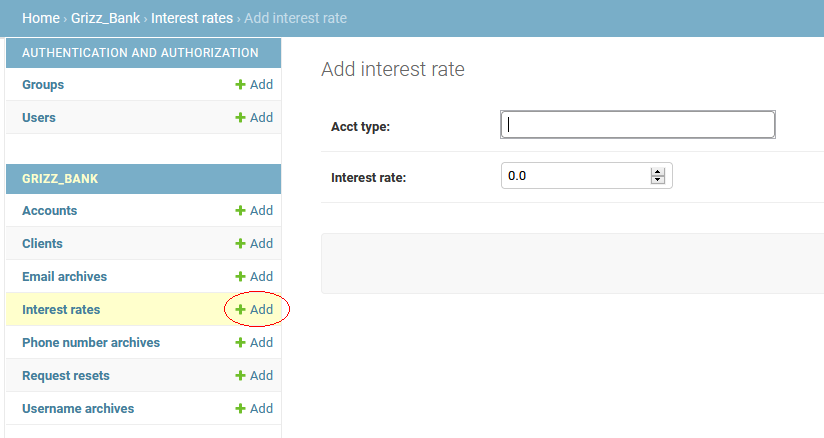
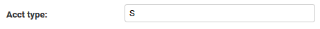
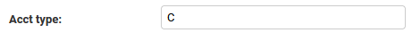

# GrizzBank Installation Guide

## Requirements:

- Python 3.6 or newer (3.9 preferred)
- MySQL Server 8.0 or newer
- Latest version of PIP python package manager
- Latest version of pipenv virtual environment manager (optional)
- The following python packages
  - Django 3.17 or newer
  - mysqlclient 2.0.3 or newer

## Instructions:

1. Clone this repository's main branch to a location on the machine you desire to run GrizzBank on
   - The cloned repo root directory will be referred to as *GrizzBankDir*
2. Ensure MySQL Server 8.0 or newer is installed.
3. Create a new database within the server titled **grizz_bank** 
  - MySQL command: ``create database if not exists grizz_bank;``
4. Install required python packages
5. open a terminal and cd into GrizzBankDir.
   
### Installation 6-7 *using pipenv*

6. Run the command to install required python packages: ``pipenv install``
7. use the command ``pipenv shell`` to enter the pipenv virtual environment.

### Installation 6-7 *without pipenv*

6. Use pip, or a virtual environment to install the required python packages.
7. Enter the virtual environment, or simply use your global python interpreter if pip was used.

### *Remaining instructions require an env with required packages*
While in your virtual environment of choice within your terminal:

8. Set up settings.py within *GrizzBankDir/Course_Project/Course_Project* 
    - set your secret key on line 23
    - set your sql username and password on lines 83, 85 respectively
    - on line 132 set the mail server to whichever server you are using
    - on line 135 set your mail user to the correct address being used
    - on line 136 set the password to your mail user
9. cd to *GrizzBankDir/Course_Project* and Perform a migration to set up your grizz_bank mysql database
    - ``python manage.py migrate``
    - Note migrations for the database are included in the repository main branch
10. run the following command to set a superuser ``python manage.py createsuperuser``
11. run the django test server via the command: ``python manage.py runserver``
    - This should provide a message that the server is active on 127.0.0.1 over port 8000
12. in your browser enter the url *localhost:8000/admin* to access the admin panel. Login with the superuser from step 10
13. Add checking and savings account types via the django admin panel per the following images:
    - interest is not yet implemented, so the interest rate values do not currently impact features
    
    

Add a savings account type

Add a checking account type

This completes the installation of GrizzBank. The web application itself can be accessed via the url: 
*localhost:/grizz_bank/* and should redirect you to the login page where you can create an account. 
